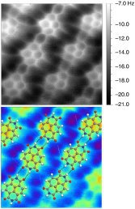

*Réponse publiée [sur Quora](https://fr.quora.com/Quelle-est-la-plus-petite-particule-de-mati%C3%A8re-observable/answer/Dr-Goulu)*

Observable comment ?

Au microscope optique ? On est limité à environ 1/2 micron par la longueur d'onde de la lumière, donc un coronavirus standard est déjà trop petit.

Au microscope électronique ? Avec un [Microscope à force atomique](w:)on distingue la structure de molecules

Le côté de cette image fait 2 nanomètres, 2 millionièmes de millimètre.

En dessous, les microscopes ne suffisent plus et on ne peut plus vraiment "voir" les particules, mais les détecter.

L'[Électron](w:)est une particule facile à détecter, alors que son diamètre fait moins de $10^{-22}m$, un dix milliardième de milliardième de millimètre. Mais il a une charge électrique, ça aide.

Le [Photon](w:)n'a pas de charge, et il est encore plus petit, peut-être une ou deux [Longueur de Planck](w:) soit $1.6x10^{-35}m$, donc un millième de milliardième d'électron. Et on arrive à les détecter un par un…
