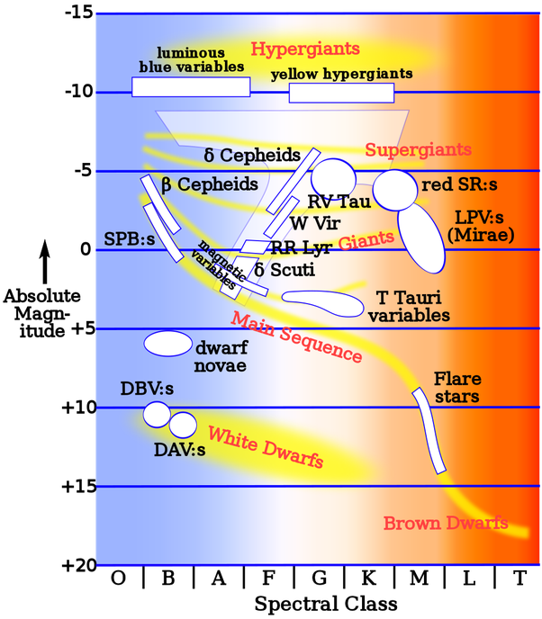

*Réponse publiée [sur Quora](https://fr.quora.com/J-ai-entendu-que-les-%C3%A9toiles-ont-des-battements-des-pulsations-que-se-passe-t-il-%C3%A0-l-int%C3%A9rieur-d-une-%C3%A9toile/answer/Dr-Goulu)*

Une étoile est en équilibre entre deux forces:

1. la gravitation qui tend à la comprimer, donc a réchauffer son coeur et augmenter les réactions de [Fusion nucléaire](w:)
2. la [Pression de rayonnement](w:) créée par la lumière (des rayons X, voire Gamma) générée par la fusion, qui dilate l'étoile et diminue la fusion.

Cet équilibre peut être plus ou moins stable, surtout quand on sait qu'un photon produit au centre du Soleil met entre 10'000 et 170'000 ans pour en sortir[[1]](#vwdRk) , en traversant toutes sortes de couches plus ou moins opaques à sa longueur d'onde, où il se fait absorber et réémettre un nombre phénoménal de fois.

Les [Étoiles variables les plus fréquentes sont les "variables pulsantes"](w:Étoile_variable)

> A certains endroits du diagramme HR, correspondant à des combinations particulières de température, de taille et de chimie interne, le flux d'énergie sortant par rayonnement varie fortement avec la densité ou la température de la matière à travers laquelle il passe. Lorsque l'[opacité](w:) d'une couche est élevée, cette couche bloque le rayonnement, l'absorbant et par conséquent devient plus chaude et gonfle. Comme la couche gonfle elle finit par refroidir, son ionisation chute et elle devient plus transparente au rayonnement, lui permettant de refroidir davantage, jusqu'à ce qu'elle refroidisse assez pour devenir plus dense et retomber dans l'étoile, et donc accroissant sa température et recommençant le cycle, provoquant des pulsations régulières. (Wikipedia)

Le "diagramme HR", c'est le fameux [Diagramme de Hertzsprung-Russell](w:), dont voici une représentation avec les diverses zones donnant des étoiles variables.

On voit qu'il y en a beaucoup, mais la plupart des étoiles sont sur la "Main Sequence" qui est stable.

C'est le cas du Soleil (Classe G, magnitude 4.74). Le [Cycle solaire](w:) de 11 ans ne cause que des variations de luminosité de 0.1% superficielles, dues à des modifications quasi périodiques de la [Dynamo solaire](w:), encore très mal connue.

Sur le diagramme HR, ne manquez pas cette extraordinaire video qui le construit à partir d'une image de Hubble, en "triant" les étoiles :

[https://youtu.be/lhSFQXrVr48](https://youtu.be/lhSFQXrVr48)

Notes de bas de page

[[1]](#cite-vwdRk)[Voyage du photon, du centre du Soleil à la Terre](http://www.astronoo.com/fr/articles/voyage-du-photon.html)
