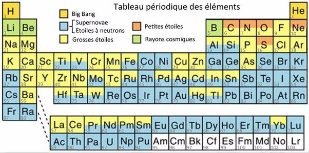

*Réponse publiée [sur Quora](https://fr.quora.com/Comment-les-atomes-les-mol%C3%A9cules-et-les-%C3%A9l%C3%A9ments-chimiques-comme-l-hydrog%C3%A8ne-qui-forment-les-plan%C3%A8tes-et-la-vie-sont-ils-apparus-dans-l-Univers/answer/Dr-Goulu)*

Ce tableau périodique résume l'origine des éléments chimiques présents sur Terre

(source [NUCLEOSYNTHESE-Observatoire de Paris](http://lastronomieselaraconte.fr/index.php/nucleosynthese) )

L'hydrogène et l'hélium se sont formés peu après le Big Bang, les autres éléments dans les étoiles de plusieurs générations et lors de leurs explosions en supernova. Les collisions d'étoiles à neutrons produisent aussi des quantités astronomiques d'éléments lourds, radioactifs, ou précieux comme l'[Or](w:) entre autres.

Le Carbone, brique de base de la chimie organique et donc de la vie est produit par la [Réaction triple alpha](w:)dans des étoiles "moyennes", ainsi que l'Oxygène, puis le [Cycle carbone-azote-oxygène](w:) produit l'Azote, et une fois éructé par teratonnes dans l'espace avec l'Hydrogène, vous avez de quoi fabriquer déjà pas mal de jolies molécules bien compliquées.

(Note : je ne suis pas tout à fait d'accord avec le tableau, notamment sur l'Helium. Celui de la Terre provient surtout de [la radioactivité naturelle](/2013/11/03/la-radioactivite-naturelle/), voir [Combien d'Helium ? - Pourquoi Comment Combien](/2010/07/04/combien-dhelium/) )
