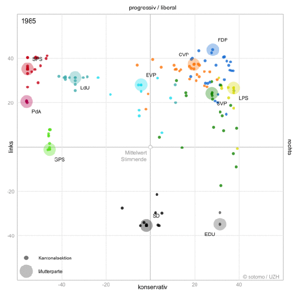

*Réponse publiée [sur Quora](https://fr.quora.com/O%C3%B9-se-situe-la-droite-fran%C3%A7aise-sur-l%C3%A9ventail-politique-des-pays-europ%C3%A9ens-avec-la-Suisse/answer/Dr-Goulu)*

En Suisse nous avons un système ([smartvote](https://smartvote.ch/fr/home)) qui permet de positionner les élus et partis sur une carte à deux dimensions avec une méthode purement mathématique, à partir de leurs réponses à un ensemble de questions.

On peut même obtenir des animations qui montrent le changement de positionnement politique des partis au cours du temps, comme celui de l'UDC (SVP en allemand, en vert foncé, qui est passé de la droite libérale à la droite conservatrice en une dizaine d'années :

A ma connaissance il n'existe pas de système équivalent dans d'autres pays, mais suite à mon article [La politique française dans la 2ème dimension ? - Pourquoi Comment Combien](/2017/05/14/la-politique-francaise-dans-la-deuxieme-dimension/), nous avons appliqué la méthode aux vote à l'assemblée nationale française et montré que votre "extrême droite" est en réalité plus conservatrice qu'à droite. (données, code et résultats sur [GitHub/goulu/smartvote Fr](https://github.com/goulu/smartvoteFR))

Pour comparer objectivement le positionnement de partis dans des pays différents, il faudrait collecter les réponses aux mêmes questions. Ça pourrait se faire facilement, notamment lors des élections européennes, mais ça ne se fait pas à ma connaissance.

En fait c'est exactement ce que nous faisons en Suisse car la carte smartvote ci dessus montre en réalité le positionnement des partis cantonaux (les points de couleur) par rapport au parti au niveau fédéral (la tache plus étendue).
