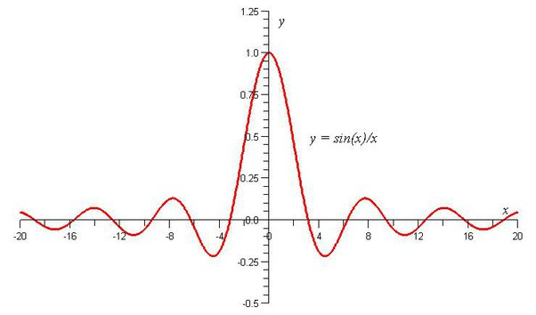
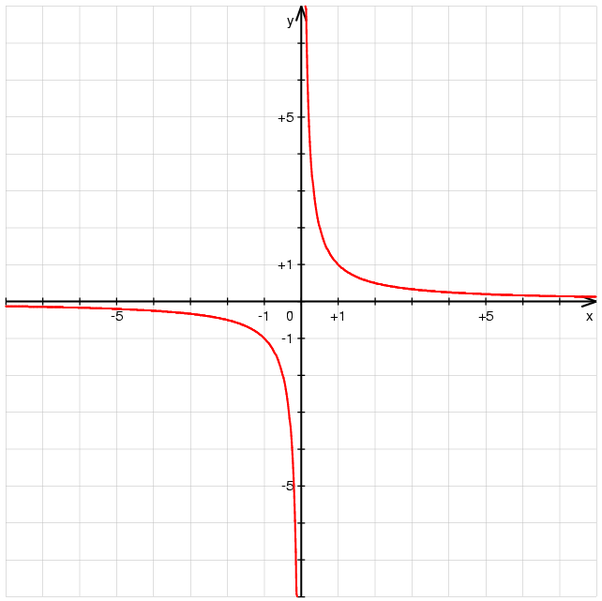

*Réponse publiée [sur Quora](https://fr.quora.com/Messieurs-dames-bonjour-pouvez-vous-m-explique-le-faite-de-pouvoir-divis%C3%A9-par-z%C3%A9ro-est-tr%C3%A8s-difficile-voire-impossible-Quelle-est-la-difficult%C3%A9-%C3%A0-franchir-Et-enfin-%C3%A0-quoi-%C3%A7a-nous/answer/Dr-Goulu)*

Les autres réponses vous expliquent pourquoi on ne peut pas diviser par zéro.

J'en rajoute juste une petite couche: si on pouvait diviser un nombre a par zéro et obtenir un autre nombre b (a/0=b en formule), alors on pourrait multiplier les deux côtés par zéro et a serait égal à b fois zéro. (a=0.b) Mais quand on multiplie un nombre par zéro, on obtient toujours zéro, donc a=0 et alors on trouve un truc marrant : 0/0 = b. Et en effet, la division 0/0 n'est pas "impossible", elle est "indéfinie" : elle peut donner n'importe quoi (voir [Zéro divisé par zéro égalent ?... - Choux romanesco, Vache qui rit et intégrales curvilignes)](http://eljjdx.canalblog.com/archives/2007/06/03/5169671.html)

Ce qui nous amène à la deuxième partie de votre question, le rapport avec le Big Bang.

En fait on a pas le droit de diviser quoi que ce soit par zéro, mais on a le droit de diviser par un nombre de plus en plus petit, en allant de plus en plus près de zéro et en calculant une "limite".

Par exemple la fonction f(x)=sin(x)/x peut être calculée pour n'importe quel nombre sauf x=0. Mais si on fait un graphique de cette fonction, on ne voit rien de spécial:

En fait il y a un minuscule "trou" pour x=0, mais aussi près qu'on s'en approche de cette "limite", sin(x)/x vaut 1.

Mais si on regarde plutôt la fonction f(x)=1/x, on obtient autre chose :

là, la valeur de y "gicle vers l'infini" quand on s'approche de x=0.

Dans les deux cas, on appelle ça une [Singularité mathématique](w:Singularité_(mathématiques)) : la valeur de la fonction, ici en x=0, n'est pas définie, on ne peut calculer que des limites lorsque x tend vers 0.

C'est ce qui arrive quand on calcule ce qui se passe au moment du Big Bang, ou dans un trou noir : on peut s'en approcher autant qu'on veut, mais pas calculer exactement ce qui se passe à ces "singularités".

D'ailleurs, on ne sait pas non plus si les maths qu'on utilise sont "correctes", si on a "le droit" physiquement de les utiliser si près des singularités. En particulier, une des grandes questions est de savoir si l'espace et le temps sont continus, ou si ce sont des valeurs "discrètes", qui ne peuvent avoir que des valeurs entières de [Temps de Planck](w:) ou de [Longueur de Planck](w:)par exemple.

Admettre ceci permet de résoudre un certain nombre de problèmes en particulier relatifs à l'entropie des trous noirs ( voir [Selon Newton, l'univers serait discret - Pourquoi Comment Combien](https://www.drgoulu.com/2011/08/13/selon-newton-lunivers-serait-digital/) ) et d'"éviter" les singularités.

C'est mon point de vue actuel : rien dans l'Univers n'est infini, ni rigoureusement nul, les singularités n'existent pas, et le Big Bang n'est pas une singularité. Les singularités mathématiques sont mathématiques, pas physiques ( jusqu'à preuve du contraire….)

Il y a d'ailleurs une chose très étrange et intéressante à ce sujet. Si les trous noirs étaient des singularités, ils devraient tourner à vitesse infinie et dans ce cas leur singularité "nue" devrait devenir visible, plus cachée derrière un "horizon des événements" . Sir Roger Penrose et Stephen Hawking ont postulé qu'une [Censure cosmique](w:) empêchait ça en limitant la vitesse de rotation des trous noir. Et justement, les mesures montrent qu'ils tournent exactement à la vitesse limite !

[A combien tourne un trou noir ? - Pourquoi Comment Combien](https://www.drgoulu.com/2016/07/10/combien-tourne-un-trou-noir/#.XuZWTEWiGCo)
