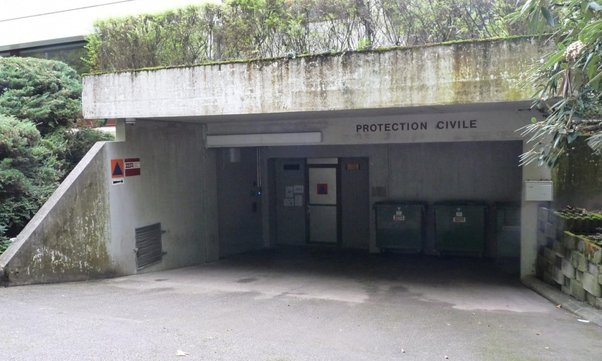
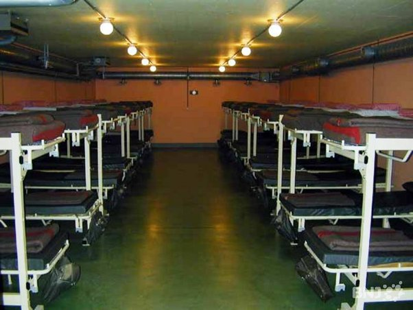

*Réponse publiée [sur Quora](https://fr.quora.com/Quels-sont-les-pays-qui-ont-des-installations-durgence-les-plus-étonnantes/answer/Loïc-Boursin)*

Les "bunkers" des photos sont des fortifications militaires , pas des abris de protection civile qui ressemblent plutôt à ça ;

