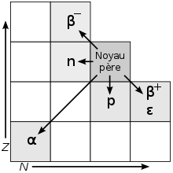

*Réponse publiée [sur Quora](https://fr.quora.com/Quels-atomes-ne-sont-ni-synth%C3%A9tisable-ni-substituable/answer/Dr-Goulu)*

Commençons par substituable : aucun. Chacun des [éléments chimiques](w:Élément_chimique) a une configuration unique de ses couches électroniques, donc des propriétés différentes.

On peut bien sur utiliser des matériaux différents pour certaines applications, comme une carrosserie de voiture, en acier, en aluminium ou en fibre de carbone, mais ça ne veut pas dire que ces éléments soient "substituables".

Synthétisable : en théorie tous, en pratique pas beaucoup.

On sait [Transmuter](w:Transmutation)les atomes en les bombardant de neutrons. La [Capture neutronique](w:) les rend radioactifs, et ensuite ils "décroissent" en un autre isotope selon le schéma suivant :

La [Radioactivité β-](w:Radioactivité_β) est celle qui nous intéresse car elle correspond à la transformation d'un neutron en proton, ce qui revient à transformer le noyau d'un élément Z en un noyau d'élément Z+1 mais de N-1 neutrons.

Donc voilà, on sait comment faire, ça a été fait en labo, et c'est fait chaque nanoseconde dans les réacteurs nucléaires du monde entier qui produisent ainsi plein d'isotopes intéressants, comme le [Plutonium](w:)apprécié des militaires. Parmi les éléments qui n'existent chez nous que par synthèse, on peut aussi mentionner le [Technétium](w:)seul élément léger non stable, donc absent dans la nature.

Ceci produit aussi des isotopes utilisés industriellement comme l' [Américium](w:)des détecteurs de fumée ou en médecine (radiothérapie), et plein d'autres dont on ne sait que faire, donc on les appelle "déchets nucléaires".

Mais en pratique, c'est une très mauvaise méthode pour produire de grandes quantités d'éléments qu'on peut trouver bêtement dans une mine parce que:

1. ça ne produit pas uniquement ce qu'on veut, mais plein d'isotopes de toutes sortes de choses plus ou moins radioactives
2. il faut attendre parfois très longtemps que les isotopes radioactifs décroissent
3. le bombardement neutronique contrôlé dans un accélérateur de particules coûte une quantité astronomique d'énergie, donc vos atomes de synthèse coûtent des millions voire milliards de fois plus cher que ceux que vous extrayez d'une mine.

Donc voilà, on sait comment faire, on le fait en petit, mais en grand, oubliez.

[Comment transformer le plomb en or ? - Pourquoi Comment Combien](https://www.drgoulu.com/2013/03/15/comment-transformer-le-plomb-en-or/#.Xu9gnmiiGCo)
