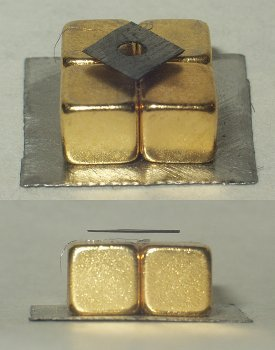

*Réponse publiée [sur Quora](https://fr.quora.com/Est-il-possible-d-arriver-%C3%A0-avoir-un-aimant-naturel-suspendu-dans-les-airs-par-sustentation-magn%C3%A9tique-au-dessus-d-un-autre-aimant-naturel/answer/Dr-Goulu)*

Oui, facile: mettez les deux aimants en position de répulsion dans un tube pour qu'ils ne puissent pas se retourner.

Sans tube, il vous faut soit placer plusieurs aimants pour obtenir une configuration stable, soit utiliser un matériau diamagnétique comme le carbone pyrolytique :

[Le carbone pyrolytique, c'est fantastique - Pourquoi Comment Combien](https://www.drgoulu.com/2014/03/15/le-carbone-pyrolytique-cest-fantastique/)
