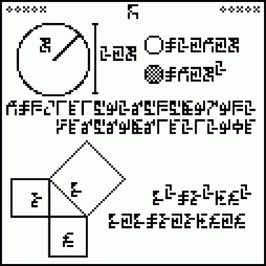

*Réponse publiée [sur Quora](https://fr.quora.com/Quelle-pourrait-%C3%AAtre-la-langue-%C3%A0-utiliser-pour-parler-avec-les-extraterrestres/answer/Dr-Goulu)*

Les maths.

C'est d'ailleurs sur cette base qu'ont été conçus les messages envoyés dans l'espace (une grave erreur…) notamment le [Cosmic Call](w:) dont voici une "page" :

Les pages font 41 x 41 bits (des nombres premiers)

En haut il y a la numérotation des pages en binaire

Les symboles ont été choisis pour être les plus distincts possible les uns des autres au cas où le bruit de transmission modifierait certains bits

[Comment comptent les Extraterrestres - Pourquoi Comment Combien](/2011/09/25/comment-comptent-les-extraterrestres/#.XvhkwiiFqCo)
