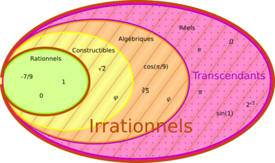

*Réponse publiée [sur Quora](https://fr.quora.com/Les-%C3%A9quations-qui-incluent-des-nombres-transcendants-comme-lidentit%C3%A9-dEuler-par-exemple-ont-elles-un-vraiment-un-sens/answer/Dr-Goulu)*

Bien sur !

D'abord, les [Nombres transcendants](w:Nombre_transcendant) forment "la plupart" des nombres réels, donc les exclure des maths serait se limiter beaucoup.

Et d'abord, pourquoi exclure les transcendants et pas les algébriques ? Et alors pourquoi pas les constructibles aussi ? Ou même les rationnels en considérant que toutes les grandeurs physiques sont des entiers (de quanta d'énergie, de longueur de Planck ou de temps de Planck …) ?

e et pi ne sont que 2 nombres parmi un très grosse infinité, mais ils ont un sens profond en maths et en physique parce qu'ils sont respectivement liés :

- aux trucs ronds, donc à la notion de distance
- aux trucs qui changent, donc aux dérivées et intégrales, donc à la notion de temps.

(ok, je suis très brutal ici, mais pensez-y…)

C'est pas de la faute des matheux si e et pi sont transcendants : c'est comme ça. Ils auraient pu être rationnels (pi=22/7 …), mais non. Ils auraient même pu être entiers si les ronds étaient carrés (pi=4) et si l'univers calculait les dérivées par des décalages en binaire (e=2). Mais non. L'Univers est comme ça, c e n'est pas un [Jeu de la vie](w:).

Bref, l'[identité d'Euler](w:)est une merveille car elle lie pi, e, mais aussi l'[unité imaginaire](w:) et les deux seuls entiers vraiment utiles : 0 et 1. Le fait qu'elles soit vraie montre que tous ces sujets sont liés.

> La mathématique est l'art de donner le même nom à des choses différentes.
> (Henri Poincaré)

Là c'est du grand art !
