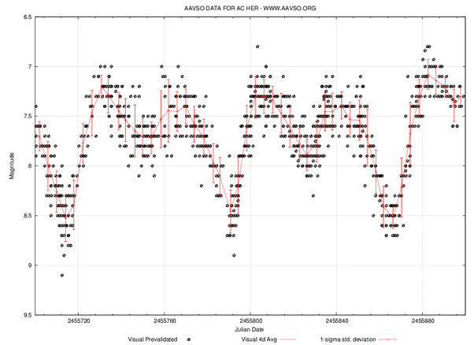

*Réponse publiée [sur Quora](https://fr.quora.com/Dautres-%C3%A9toiles-ont-elles-des-cycles-%C3%A0-lint%C3%A9rieur-dautres-cycles-comme-pour-notre-soleil-avec-ses-maximums-et-minimums-%C3%A0-lint%C3%A9rieur-de-grands-maximums-et-minimums-solaires-et-peut-%C3%AAtre/answer/Dr-Goulu)*

oui , les [Étoiles variables](w:Étoile_variable) variables sont très courantes.

Le Soleil est très stable, le [Cycle solaire](w:) de 11.2 ans en moyenne ne provoque une variation de luminosité que de 0.1%, due à la présence de taches solaires liées à son champ magnétique. Avec des variations si faibles, l'existence de cycles plus longs est encore hypothétique.

D'autres étoiles ont des cycles beaucoup plus complexes et importants, par exemple les [Étoile variable de type RV Tauri](w:)comme AC Herculis, dont la [magnitude](w:Magnitude_apparente) varie de 2, donc la luminosité d'un facteur 6 en montrant clairement une combinaison de deux cycles harmoniques :

