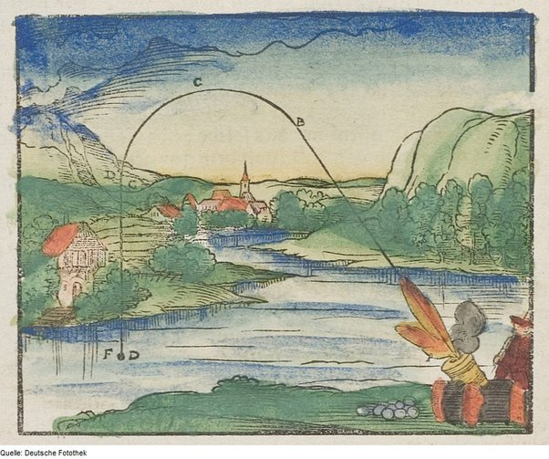

*Réponse publiée [sur Quora](https://fr.quora.com/Regarder-la-r%C3%A9alit%C3%A9-math%C3%A9matiquement-est-il-une-repr%C3%A9sentation-pr%C3%A9cise-de-la-fa%C3%A7on-dont-les-choses-fonctionnent/answer/Dr-Goulu)*

Non, mais c'est la meilleure qu'on aie.

Les maths fournissent des modèles de ce qu'on observe, et permettent de faire des prédictions très utiles en pratique. Et surtout on peut améliorer le modèle avec le temps.

Exemple : la trajectoire des boulets de canon et autres projectiles.

Quand des philosophes s'intéressent à la balistique, ça donne ça:

> Selon Aristote, il existe deux types de mouvements, le mouvement naturel ramenant les objets vers leurs lieux d'origine, et le mouvement violent, impulsé par un objet à un autre. Ainsi, la pierre tombe car elle revient naturellement à son lieu d'origine, la Terre, alors que le feu s'élève car son lieu d'origine est l'air. D'autre part, tout objet pour être déplacé doit être mû par une action, l'arrêt de l'action entraînant l'arrêt de l'objet. Se pose alors la question d'expliquer pourquoi une pierre lancée en l'air continue son mouvement avant de retomber. Aristote explique cela par le fait que la pierre qui se déplace laisse un vide (ou plutôt une raréfaction de l'air) derrière elle, qui se remplit immédiatement d'air, celui-ci poussant alors la pierre en avant ( [Impetus — Wikipédia](w:Impetus))

En gros on fait des hypothèses (eau, feu, terre, air…) et on essaie désespérément de faire coller la réalité à ça.

Au Moyen-Âge on s'aperçoit que c'est totalement inutile pour balancer un boulet sur un ennemi, donc on ajoute un peu de géométrie à la philosophie et ça donne un truc un peu moins faux :

(Je me demande toujours comment ils calculaient le point B et le rayon de C, faudrait que je lise [La Nova Scientia](w:) … )

L'idée nouvelle ici, c'est de décomposer le mouvement en plusieurs phases.

Arrive le Grand Newton, qui se dit : tant qu'à faire autant le décomposer en une infinité de phases. Comme un boulet c'est très con, à chaque phase il croit qu'il a été tiré à la phase précédente, et il fait la même chose à chaque étape continuer son mouvement tout en se faisant attirer par la Terre avec une force constante. J'invente les maths qu'il faut … et hop ! Si je néglige le frottement dans l'air parce que sinon c'est trop compliqué, j'obtiens une trajectoire parabolique….

Et si la Terre est ronde et que je tire le boulet très très vite ? Tiens, il ne retombe pas sur Terre, il se met en orbite autour, un peu comme la Lune … Ah ben les planètes, ce sont des boulets, en fait …

Arrive Albert qui dit : Isaac tu es génial, mais comment les planètes savent que le Soleil est là, vu qu'elles sont aussi stupides que des boulets ? Et si on disait plutôt … attends, j'invente les maths qu'il faut… oui ça joue! (Einstein était suisse…) : en fait le projectile est encore plus stupide que tout ce qu'on pensait , il va tout droit dans un espace courbé par les masses, du Soleil, de la Terre et de tout le reste. Et en passant ça explique pourquoi [le périhélie de Mercure avance](w:Tests_expérimentaux_de_la_relativité_générale), et en plus je prédis qu'il doit se passer des trucs marrants autour des corps très massifs, encore plus quand ils tournent, et le top du top c'est quand ils se tournent autour super vite.

Parallèlement [Leonhard](w:Leonhard_Euler)s'est dit : trop compliqué avec frottement de l'air ? pas pour un modeste mathématicien suisse. J'invente les maths qu'il faut et je te calcule la trajectoire. Bon, ouch, c'est pas facile, faudrait des machines qui intègrent très vite des équations différentielles …

Après ça, [Henri et Georges-Gabriel](w:Équations_de_Navier-Stokes) ont dit : ok, mais le frottement dans l'air c'est pas simple, ça fait des tourbillons, des ondes de choc et les équations différentielles deviennent non linéaires… on va les écrire sous une jolie forme et laisser [quelqu'un d'autre les résoudre…](w:Solutions_des_équations_de_Navier-Stokes)

Donc voilà les maths qu'on a développés pour un boulet se sont révélées généralisables, et je crois que c'est la principale force des mathématiques:

> La mathématique est l'art de donner le même nom à des choses différentes.
> (Henri Poincaré)

Plus on avance, plus on s'aperçoit que des choses qui n'ont l'air d'avoir aucun rapport en ont. Mais les mathématiques ne font que "donner le même nom" à ces rapports, les décrire de façon formelle, synthétique et utile pour nous.

La "façon dont les choses fonctionne" n'est pas l'objet des mathématiques. C'est peut-être l'objectif ultime de la physique, mais il y a encore du boulot.

Donc les philosophes ont encore beaucoup de latitude pour dire des âneries sur ce sujet.
