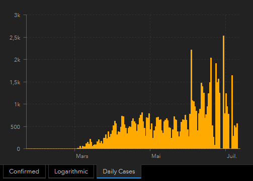
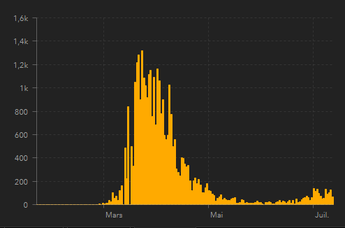
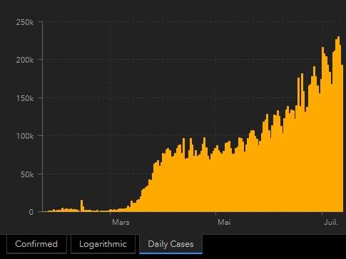

*Réponse publiée [sur Quora](https://fr.quora.com/Si-le-coronavirus-est-si-mortel-pourquoi-la-Suède-a-t-elle-pu-le-traiter-en-nintroduisant-pas-réellement-des-règles-plus-strictes/answer/Dr-Goulu)*

les chiffres du jour sont de 75826 cas pour la Suède, dont 5536 morts ( [https://www.arcgis.com/apps/opsd...](https://www.arcgis.com/apps/opsdashboard/index.html), données [CSSEGISandData/COVID-19](https://github.com/CSSEGISandData/COVID-19) )

Le nombre de nouveaux cas par jour est très bruité

En Suisse (8/10ème de la population de la Suède), nous avons 32946 cas (moins de la moitié de la Suède), 1968 morts (le tiers, ou moins de la moitié avec la correction de la population) et la courbe fait ça

En France ils en sont à 30'000 morts alors que la grippe fait en moyenne 10'000.

Cette épidémie a déjà fait 573'000 morts au niveau mondial. C'est pour l'instant autant qu'une grippe saisonnière normale, en effet mais

1. nous sommes quelques uns à avoir de gros doutes sur les chiffres de certains (gros) pays
2. ce n'est pas fini

