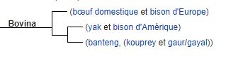

*Réponse publiée [sur Quora](https://fr.quora.com/Quelle-est-la-diff%C3%A9rence-entre-un-bison-et-une-vache/answer/Dr-Goulu)*

Les [Bisons](w:Bison) sont un genre constitués de deux espèces :

- le [bison d'Europe](w:) (*Bison bonasus*)
- et le [bison d'Amérique du Nord](w:) (*Bison bison*)

toutes les vaches du monde, ou plutôt les "boeufs domestiques" sont d'une seule espèce, [Bos taurus](w:) du genre [Bos](w:) qui compte quelques autres espèces comme le zébu, le yak, le [gaur](w:Gayal), le [gayal](w:) , le [banteng](w:) ou le [kouprey](w:)

Les deux genres (bisons et bos) appartiennent à la tribu des [Bovina](w:), mais des études génétiques récentes remettent en question cette séparation en deux genres et proposent plutôt la phylogénie suivante :

Dans ce cas, la vache serait "cousine proche" du bison d'Europe (mais les vaches descendent de l' [Aurochs](w:)disparu, pas du bison), mais "cousine éloignée" du bison d'Amérique, lui étant "cousin proche" du yak.
