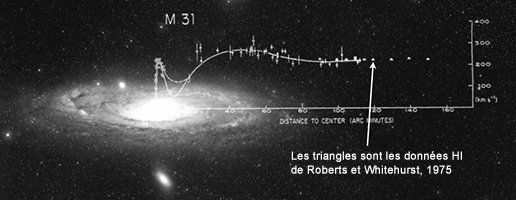

*Réponse publiée [sur Quora](https://fr.quora.com/Comment-sait-on-que-le-nombre-de-trous-noirs-est-insuffisant-pour-expliquer-la-matière-noire/answer/Dr-Goulu)*

une galaxie, ce n'est pas à si grande échelle que ça… Le premier effet de la "matière noire" est l'anomalie de la [Courbe de rotation des galaxies](w:). Pour Andromède qui est "juste à côté" et qu'on voit très bien, ça donne ça:

(source : [Les problèmes du modèle Standard](http://www.astrosurf.com/luxorion/cosmos-problemestd.htm) sur Astrosurf)

Effectivement, il pourrait y avoir un effet bizarre de la gravitation à longue distance. C'est l'idée de la [Théorie MOND](w:)par exemple. Donc non, ce n'est pas exclu.

(pour ma part je suis persuadé que la matière+énergie noire ne sont ni de la matière, ni de l'énergie, sinon on aurait déjà trouvé…)
