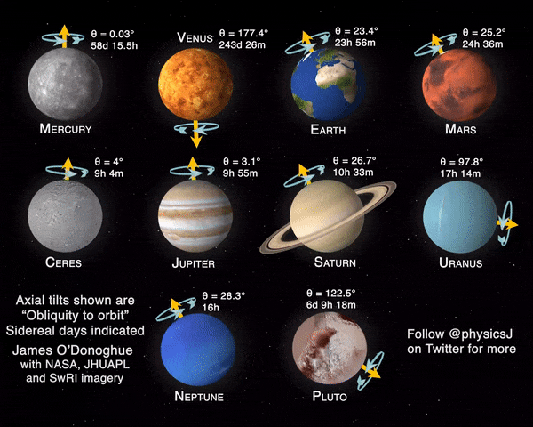

*Réponse publiée [sur Quora](https://fr.quora.com/Pourquoi-V%C3%A9nus-est-si-particuli%C3%A8re-rotation-r%C3%A9volution-autour-du-soleil-atmosph%C3%A8re-si-particuli%C3%A8re-et-ind%C3%A9pendante-de-la-plan%C3%A8te-Y-a-t-il-des-hypoth%C3%A8ses/answer/Dr-Goulu)*

toutes les planètes sont "particulières".

Pour la révolution autour du Soleil, elle n'a rien de particulier. Son orbite est la moins elliptique du système solaire, c'est tout. Certains sites mal informés disent qu'elle tourne à l'envers des autres planètes, c'est totalement faux.

Pour la rotation, Vénus est presque en rotation synchrone, mais "à l'envers" : elle tourne en un peu plus d'une de ses années. Les planètes et petites planètes du système montrent une assez grande variété, résultat "normal" étant donné le processus de formation des planètes par agrégation de planétoïdes.

Par contre son atmosphère est en rotation rapide et on soupçonne une interaction entre les deux [[1]](#IYRMB)

Reste la densité de l'[Atmosphère de Vénus](w:), qui est en effet surprenante. Mais pas tant que ça si on considère son [évolution probable](w:Atmosphère_de_Vénus). Sur Terre aussi il y avait énormément de CO2 avant que les cyanobactéries provoquent la [Grande Oxydation](w:) qui a formé de l'oxygène moléculaire, abaissé la température et donc conservé l'eau.

Sur Vénus, l'effet de serre était trop prononcé, l'eau liquide s'est évaporée et échappée dans l'espace, et il reste le CO2. La masse d'azote dans l'atmosphère de Vénus est du même ordre de grandeur que sur Terre.

Notes de bas de page

[[1]](#cite-IYRMB)[Vénus : le mystère de la super-rotation de son atmosphère enfin résolu ?](https://www.futura-sciences.com/sciences/actualites/venus-venus-mystere-super-rotation-son-atmosphere-enfin-resolu-80732/)
