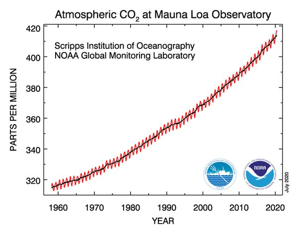

*Réponse publiée [sur Quora](https://fr.quora.com/Où-les-éprouvettes-dair-servant-à-mesurer-la-teneur-en-CO2-sont-elles-prélevées/answer/Dr-Goulu)*

On a beaucoup parlé des mesures au Mauna Loa parce que ce site est très éloigné des sources de CO2 et qu'il mesure en continu depuis 60 ans.

Sur leurs mesures ont voit bien une petite oscillation annuelle et quelques petites variations peut être d'origine volcanique, mais ya pas photo : la tendance globale n'a aucune autre explication que les activités humaines.

(Source [Carbon Cycle Greenhouse Gases](https://www.esrl.noaa.gov/gmd/ccgg/trends/))

Le même site montre la même tendance pour le méthane ici : [Carbon Cycle Greenhouse Gases](https://www.esrl.noaa.gov/gmd/ccgg/trends_ch4/)

En moyenne, les volcans n'émettent même pas 1% des émissions anthropiques de CO2. (voir [Quel est l'impact des volcans sur les émissions de CO2 et le changement](https://www.notre-planete.info/actualites/2862-emissions-CO2-volcans-changement-climatique)climatique ?)

Par contre ils émettent beaucoup de SO2 qui a un effet "refroidissant". Le SO2 permet de mesurer l'activité volcanique et au Mauna Loa il est resté constant (voir [Hawaiian Volcano](https://volcanoes.usgs.gov/observatories/hvo/hvo_monitoring_gas.html)Observatory)

Donc non, la hausse du CO2 n'est pas d'origine volcanique, ni au Mauna Loa ni ailleurs.

Elle est d'origine humaine.
