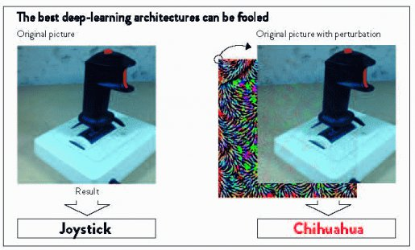

*Réponse publiée [sur Quora](https://fr.quora.com/Ray-Dalio-quand-pouvez-vous-faire-confiance-au-Machine-Learning-et-quand-ne-le-pouvez-vous-pas/answer/Dr-Goulu)*

Comme les humains : quand ils ont été entraînés à résoudre le problème que vous voulez résoudre.

le machine learning utilise un mécanisme d'apprentissage basé sur beaucoup de cas. Si ensuite vous lui soumettez un problème "proche" des cas qu'il a appris, il le résoudra. Si le problème est trop éloigné, le résultat ne sera pas fiable.

En fait, en connaissant le fonctionnement de l'apprentissage on peut même concevoir des perturbations qui "mettent sur le toit" un algo de machine learning assez facilement:

[When deep learning mistakes a coffee-maker for a cobra](https://sti.epfl.ch/when-deep-learning-mistakes-a-coffee-maker-for-a-cobra/)

Bref, si VOUS connaissez le dataset utilisé pour l'apprentissage et que VOUS fournissez des données dont vous connaissez l'origine, VOUS pouvez lui faire confiance autant (voire plus) qu'à un humain.
