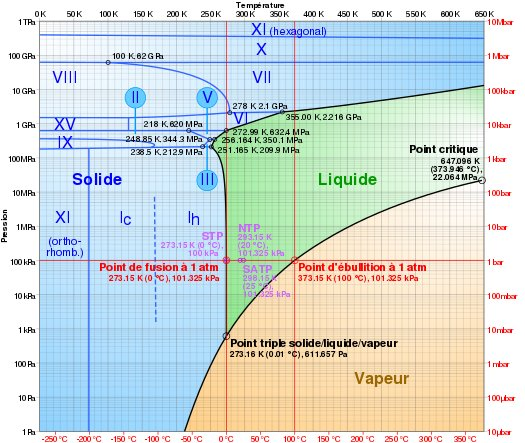

*Réponse publiée [sur Quora](https://fr.quora.com/Comment-appelle-t-on-un-matériau-dont-la-forme-solide-flotte-dans-sa-propre-forme-liquide-leau-par-exemple/answer/Dr-Goulu)*

ouaip ! et t'as vu celui avec les phases de glace ?

[La glace-9 de Vonnegut peut-elle exister ? - Pourquoi Comment Combien](https://www.drgoulu.com/2012/11/05/glace-9/#.XzPnHSiFqCo)

me demande s'il en existe avec la densité en 3ème dimension …
