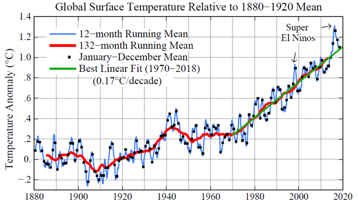

*Réponse publiée [sur Quora](https://fr.quora.com/Croyez-vous-au-changement-climatique-massif/answer/Dr-Goulu)*

[Réchauffement climatique : évolution du climat mondial et en France](http://www.meteofrance.fr/climat-passe-et-futur/le-rechauffement-observe-a-l-echelle-du-globe-et-en-france)

Les faits sont des mesures, ils n'ont pas à être prouvés.
