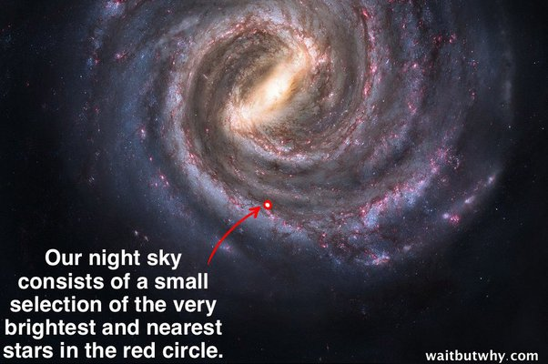

*Réponse publiée [sur Quora](https://fr.quora.com/Les-%C3%A9toiles-que-nous-voyons-dans-le-ciel-%C3%A0-l%C5%93il-nu-font-elles-seulement-partie-de-notre-galaxie-la-Voie-Lact%C3%A9e/answer/Dr-Goulu)*

Oui, et même seulement d'une toute petite partie de la Voie Lactée. A l'échelle, seules les plus brillantes de celles qui se trouvent dans une petite sphère autour de nous :

C'est un peu exagéré parce que l'étoile la plus lointaine visible à l'oeil nu est [Rho Cassiopeiae](w:) à 8100 années-lumière, le diamètre de la Voie Lactée étant de 120'000 années-lumière.

Le seul objet extragalactique visible à l'oeil nu est la galaxie d'Andromède, à 2,537 millions d'années-lumière de nous, mais elle est composée de 1000 milliards d'étoiles …
