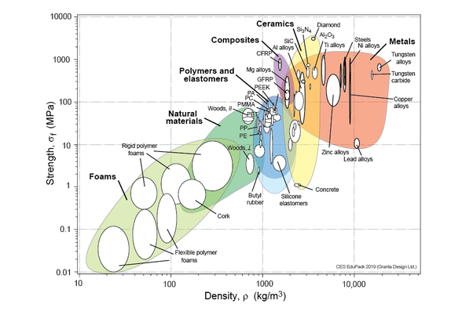

*Réponse publiée [sur Quora](https://fr.quora.com/Quel-est-la-mati%C3%A8re-la-plus-r%C3%A9sistante-par-rapport-%C3%A0-son-poids/answer/Dr-Goulu)*

Les diagrammes d'[Ashby](w:Michael_Ashby)servent à sélectionner des matériaux selon des rapports entre propriétés.

Le rapport$\sigma_{max}/\rho$ est dans le diagramme suivant:

(source : [Material property charts | Granta Design](https://www.grantadesign.com/education/students/charts/) )

Le matériau que vous cherchez est celui situé sur la parallèle à la diagonale la plus haute : le CFRP, [Polymère renforcé de fibres de carbone](w:)en français.

Le diamant n'est pas mal non plus, mais pour les avions, bateaux, voitures de sport etc, on préfère le CFRP…
