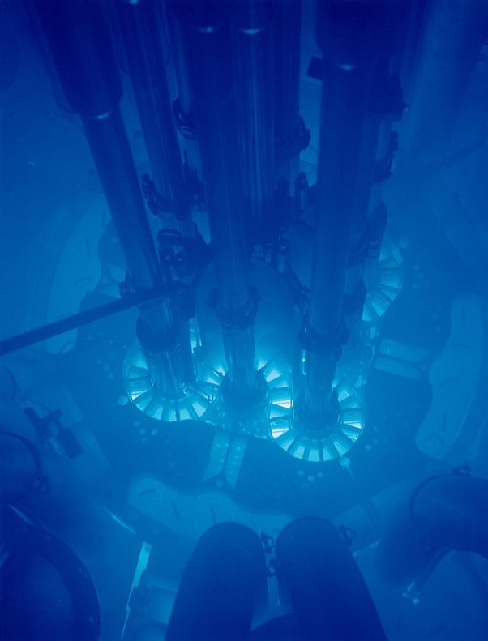

*Réponse publiée [sur Quora](https://fr.quora.com/Quand-un-objet-dépasse-la-vitesse-du-son-il-y-a-un-bang-supersonique-hypothétiquement-si-un-objet-dépasse-la-vitesse-de-la-lumière-y-aurait-il-un-effet-similaire/answers/235114773)*

Non, tu ne dis pas de bêtises, Anonyme

Tu peux même mettre des liens dans ta réponse comme [Effet Vavilov-Tcherenkov — Wikipédia](w:Effet_Vavilov-Tcherenkov) pour que les gens puissent vérifier, et encore plus mieux bien des images. Celles de la Wikipédia sont en Créative Commons, donc tu as le droit :

ça rend les réponses moins anonymes ;-)
