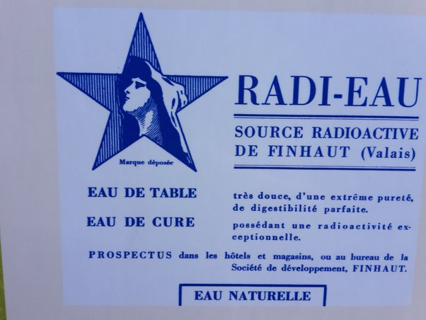

*Réponse publiée [sur Quora](https://fr.quora.com/Pourra-t-on-un-jour-connaître-les-fréquences-des-nanoparticules-atomiques-quantiques-pour-soigner-nos-maladies/answer/Dr-Goulu)*

oui moi aussi, au moins c'était local

les habitants de Finhaut n'ont plus le droit de consommer l'eau qu'ils ont bue depuis des siècles en raison de nouvelles normes … sur l'arsenic !

[Vallée du Trient: 6 millions seront investis pour lutter contre l’arsenic dans l’eau](https://www.lenouvelliste.ch/articles/valais/martigny-region/arsenic-65-millions-seront-investis-dans-la-vallee-du-trient-pour-purifier-l-eau-844917)
