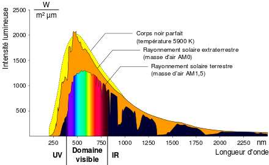

*Réponse publiée [sur Quora](https://fr.quora.com/Comment-le-Soleil-émet-il-de-la-lumière-Crée-t-il-les-photons/answer/Dr-Goulu)*

la lumière est une petite bande de fréquences des ondes électromagnétiques. le [Rayonnement solaire a](w:Rayonnement_solaire) un "spectre du corps noir" à 5800K qui ressemble à ça:

C'est donc surtout visible + infrarouge, cette bonne chaleur…

Ca monte pas plus haut que les UV, et en dessous des IR il n'y a plus beaucoup de puissance …
