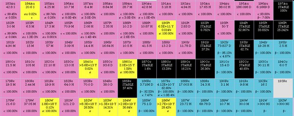
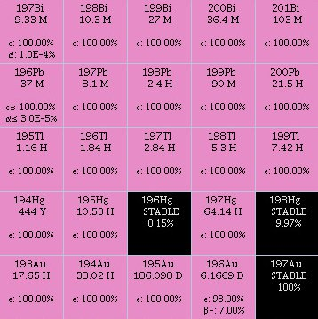

*Réponse publiée [sur Quora](https://fr.quora.com/Peut-on-obtenir-de-lor-num%C3%A9ro-atomique-79-en-bombardant-deux-autres-%C3%A9l%C3%A9ments-par-exemple-Ba-56-avec-Va-23/answer/Dr-Goulu)*

Aucune chance.

D'abord, les isotopes stables du [Baryum](w:) ont entre 76 et 82 neutrons en plus de leur 56 protons, et le [Vanadium](w:en:Vanadium)28 neutrons.

En réalisant une fusion, vous allez théoriquement produire un noyau contenant entre 104 et 110 neutrons, il en manque au moins 8 pour faire l'isotope stable de l'Or, Au197 qui en contient 118.

Mais (à ma grande surprise), la [Table des isotopes](w:), dit que vos isotopes "Au 183" à "Au189" (ligne du haut à gauche dans le graphique ci-dessous) vont subsister avec une vie de quelques minutes, puis il vont subir une [Désintégration β+](w:Radioactivité_β) qui transforme 1 proton en neutron , ce qui décale l'isotope d'une case en diagonale vers le bas et à droite*. Ca va donc donner … du platine ! (cool…)

Malheureusement, ce platine est instable aussi, et après une beta+ de plus, vous allez avoir de l'Iridium, toujours instable jusqu'à former un isotope stable, de l'[Osmium](w:), du [Rhénium](w:), du [Tantale](w:) ou du [Tungstène](w:). D'ailleurs j'apprends grâce à votre question que le Tungstène (W) n'a pas d'isotope stable théoriquement, mais en pratique avec 10^18 ans c'est comme si …

Bref, maintenant que vous avez pigé ça vous avez compris que pour faire de l'or il faut produire un isotope radioactif d'un élément plus lourd que l'or et attendre qu'il décroisse. N'importe lequel sur la diagonale gauche->droite descendante de ce carré convient :

D'ailleurs c'est comme ça que [Seaborg a transmuté quelques centaines d’atomes de bismuth (197) en or en 1980](w:en:Glenn_T._Seaborg) .

Mais le problème n'est pas là. Il faut commencer par produire cet isotope radioactif, et là on ne sait absolument pas réaliser des fusions d'éléments lourds. Tout ce qu'on sait faire c'est bombarder un élément avec des neutrons, donc décaler son isotope horizontalement vers la droite d'une case. Sauf qu'on sait pas compter les neutrons, donc on va produire une ribambelle de trucs radioactifs avec des périodes en tout genre qui n'ont rien à envier à des déchets nucléaires, qui sont d'ailleurs exactement ça.

Et là dedans il y aura peut-être quelques atome de l'or le plus cher du monde.

[Comment transformer le plomb en or ? - Pourquoi Comment Combien](https://www.drgoulu.com/2013/03/15/comment-transformer-le-plomb-en-or/)

Note* les isotopes en jaune produisent des désintégrations alpha : deux cases en bas, mais à gauche pour varier les plaisirs du jeu de l'oie …
