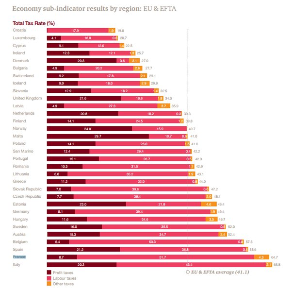

*Réponse publiée [sur Quora](https://fr.quora.com/Pourrait-on-remplacer-la-bourse-scolaire-par-un-pr%C3%AAt-%C3%A0-taux-z%C3%A9ro-et-autoriser-le-non-remboursement-du-pr%C3%AAt-pour-ceux-restant-9-mois-par-an-sur-le-territoire-national-Cela-aiderait-il-%C3%A0/answer/Dr-Goulu)*

Non. L'[Introduction en bourse](w:) se fait quand l'entreprise a déjà beaucoup grandi et vaut des dizaines de millions, voire des milliards. Pour beaucoup de cerveaux créateurs d'entreprise, c'est le moment où ils vont enfin encaisser des millions pour leurs années de travail et de stress. Ils espèrent faire du 10'000% sur la valeur de leurs actions, pas du 0 …

Avant ça, l'entreprise est financée par "la famille, les amis et les ennemis" . A ce stade aucune institution ne prend un risque élevé pour un taux faible. A part de petites aides locales au démarrage, personne ne prête : on investit. Le créateur d'entreprise donne en échange du pognon des bouts de papier nommés "actions" qui sont des titres de propriété sur l'entreprise. C'est à ce stade qu'interviennent les entreprises de [Capital risque](w:), mais elles visent des rendements de centaines de pourcents, pas 0, ni 3 ni meme 10.

Chers voisins, vous avez (au moins) deux problèmes qui font fuir vos cerveaux:

1. les salaires des chercheurs. Quand j'étais assistant doctorant à l'EPFL, je gagnais deux fois plus que le membre de mon jury de thèse chercheur au CNRS, qui gagnait le quart de mon prof. Pas étonnant que beaucoup de vos chercheurs viennent chercher ici …
2. au moment de créer leur entreprise, les cerveaux tombent sur le graphique ci-dessous :

(fiscalité des entreprises selon [Les charges des entreprises ont-elles « augmenté tous les ans » ?](https://www.lemonde.fr/blog/decodeurs/2014/01/20/les-charges-des-entreprises-ont-elles-augmente-tous-les-ans/), Le Monde)

Là ils réalisent qu'en France, les deux tiers de ce que leur entreprise gagnera partira en taxes sur le travail des employés. Et s'ils ne réalisent pas, leur capital-risqueur le sait très bien et déplacera l'entreprise à l'étranger dès que la boite fera des benefs.

Parce que'en réalité la situation est encore pire. Comme nous l'avait montré un entrepreneur allemand qui avait fait plein de calculs précis (il y a 20 ans, ça a peut-être changé…), la France est attractive quand l'entreprise perd de l'argent. Là elle est exemptées de certaines taxes, reçoit des aides, du personnel stagiaire gratuit etc. Donc le contribuable français finance la croissance d'entreprise qui déménagent après …

J'aime bien votre idée parce qu'elle est typique d'une tournure d'esprit bien française : "On va surtout pas copier ce qui marche dans les autres pays, on va faire autrement. On peut faire mieux. Et si ça ne marche pas, ça ne fait rien, on recommencera…".

Merci. C'est en bonne partie grâce à ça que certains de vos voisins récoltent vos cerveaux et votre pognon.
