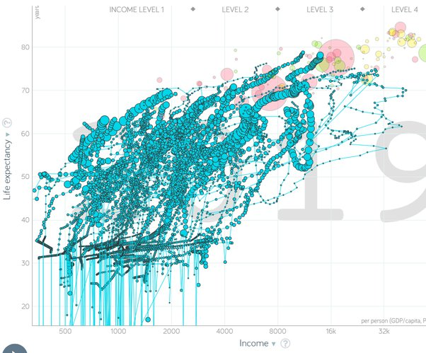

*Réponse publiée [sur Quora](https://fr.quora.com/Pourquoi-la-majorité-des-pays-noirs-sont-pauvres/answer/Dr-Goulu)*

mon premier jet était beaucoup plus incisif envers celui qui parle de "pays noirs". Non ma réponse n'est pas sarcastique du tout, et si vous vous considérez comme un raciste blanc, c'est votre problème. Ma réponse fait état d'un racisme indiscutable de toute la société européenne jusqu'à très récemment, vous en trouvez des traces bien visibles dans toutes les bonnes brocantes. Je vous laisse aussi la responsabilité du lien que vous faites "africains victimes => êtres inférieurs". Idem pour les indiens d'Inde et d'Amérique, les asiatiques etc donc ?

C'est un fait historique établi que les puissances coloniales européennes ont conquis militairement des colonies dont ils ont exploité les ressources jusque dans la seconde moitié du 20ème siècle, et que depuis, les pays libérés ont, sauf exceptions dues à des conflits, des croissances économiques et sanitaires tout à fait comparables à ceux que nous avons eus (Bien sur qu'il y a eu des guerres et des génocides en Afrique, chez nous aussi. Ce n'est donc pas ce qui fait la différence.)

J'ai choisi 4 grands pays africains un peu au pif, mais vous pouvez utiliser le lien (ah non il ne marche pas… mais vous pouvez jouer avec [Gapminder Tools](https://www.gapminder.org/tools/#$chart-type=bubbles), c'est assez intuitif) pour sélectionner les autres. Et comme vous mentionnez 65 pays, le Maghreb est dedans aussi. En enlevant les noms de pays parce qu'il n'y a pas la place et en partant de 1900 ca donne ça :

(en transparence derrière il y a la situation actuelle des pays asiatiques en rouge (Chine et Inde sont les plus gros), américains en vert et européens en jaune .

Je vous conseille vivement les conférences de Hans Rosling notamment [Les meilleures statistiques jamais vues](https://www.ted.com/talks/hans_rosling_the_best_stats_you_ve_ever_seen?language=fr) qui montre qu'il n'y a plus de Tiers-Monde! Je ne sais pas si c'est dans celle là qu'il dit "les gens ont la vision du monde qu'avaient leurs profs quand ils allaient à l'école". C'est exactement ce qui empêche de voir que le monde, et en particulier l'Afrique, a totalement changé. Ok, beaucoup sont encore aussi pauvres que nous l'étions il y a 70 ans, mais ça change très vite.
