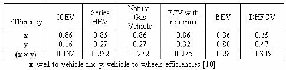

*Réponse publiée [sur Quora](https://fr.quora.com/Bonjour-quel-est-le-rendement-de-la-fili%C3%A8re-hydrog%C3%A8ne-en-automobile-Si-je-consomme-un-kw-pour-produire-de-lhydrog%C3%A8ne-par-%C3%A9lectrolyse-et-que-je-lutilise-dans-ma-pile-%C3%A0-combustible-je/answer/Dr-Goulu)*

en anglais ils appelle ça "well to wheel efficiency", rendement "du puits aux roues", qui est le produit du rendement "well-to-tank" (puits au réservoir) et du "tank-to-wheels" (réservoir aux roues)

Selon[[1]](#yfLhM) ces rendements sont les suivants :

pour les véhiculeset filières suivantes:

- ICEV "internal combustion engine vehicles " : moteur à combustion interne (essence ou diesel)
- HEV "Hybrid Electric Vehicle" : véhicule hybride
- FCV "Fuel Cell Vehicle" : véhicule à pile à combustible à reformage (l'hydrogène est produit dans la voiture à partir d'un autre combustible : gaz, methanol, essence
- BEV "Battery Electric Vehicle" : véhicule électrique à batterie
- DHFCV : "Direct Hydrogen Fuel Cell Vehicle" . C'est là qu'on trouve la réponse à votre question : 30.5%

Notes de bas de page

[[1]](#cite-yfLhM)[https://www.researchgate.net/pub...](https://www.researchgate.net/publication/224712974_New_generation_of_passenger_vehicles_FCV_or_HEV)
