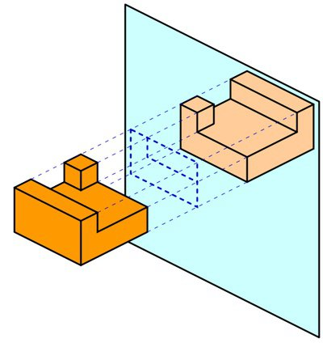

*Réponse publiée [sur Quora](https://fr.quora.com/Quand-je-me-regarde-dans-un-miroir-et-je-l%C3%A8ve-le-bras-droit-mon-reflet-l%C3%A8ve-son-bras-gauche-La-droite-devient-la-gauche-pour-le-reflet-Pourquoi-le-haut-ne-devient-pas-le-bas/answer/Dr-Goulu)*

Un miroir réfléchit simplement la lumière en n’inversant rien du tout : en face d’un miroir, la lumière issue de votre main droite rebondit sur le miroir et arrive à vos yeux par la droite. La lumière venant de vos pieds vous parvient de même par le bas : tout est à sa place. Tout, sauf la “profondeur” : c’est en fait la distance des objets au miroir, autrement dit “l’avant” et “l’arrière” qui sont “inversés”:

[MIROIR | ЯIOЯIM - Pourquoi Comment Combien](/2009/04/04/miroir/#.X15D82iFqCo)
