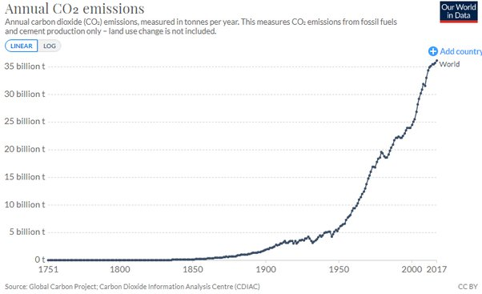

*Réponse publiée [sur Quora](https://fr.quora.com/Comment-une-éruption-volcanique-influence-le-climat/answer/Dr-Goulu)*

Ah vous voulez dire pour le CO2 ? Alors disons que Toba a libéré 100x plus de CO2 que la moyenne du cumul annuel de tous les volcans de la Terre. Ca fait une année d'émissions anthropiques. 1000x plus alors ? Ok, ça fait 10 ans d'émissions anthropiques. Mais c'est une fois tous les 70'000 ans

Nous, c'est l'intégrale sous cette courbe :

