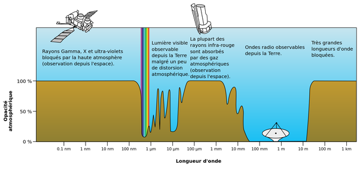

*Réponse publiée [sur Quora](https://fr.quora.com/Est-ce-que-cest-possible-que-la-France-ne-soit-pas-capable-de-fournir-de-lénergie-aux-futurs-nombreuses-antennes-5G-fortement-énergivore/answer/Dr-Goulu)*

Je faisais référence un peu brutalement à l'atténuation de l'atmosphère, ci-dessous dans son "épaisseur" mais au niveau du sol on a quand même une forte atténuation due à la vapeur d'eau (voir ([https://www.itu.int/dms_pubrec/i...](https://www.itu.int/dms_pubrec/itu-r/rec/p/R-REC-P.676-11-201609-I!!PDF-F.pdf) ([https://www.itu.int/dms_pubrec/i...](https://www.itu.int/dms_pubrec/itu-r/rec/p/R-REC-P.676-11-201609-I!!PDF-F.pdf)) p 17)

donc jusque vers 3.5 GHz (fréquences actuelles) on a pas trop de problèmes. Au dessus ( voir [Les changements technologiques de la 5G](https://www.anfr.fr/publications/dossiers-thematiques/la-5g/les-changements-technologiques-de-la-5g/)) il y a quelques bandes de fréquences envisagées pour le futur, notamment 26 GHz (= 11 mm, juste entre les deux pics d'atténuation de l'eau) mais c'est déjà bien atténué …
