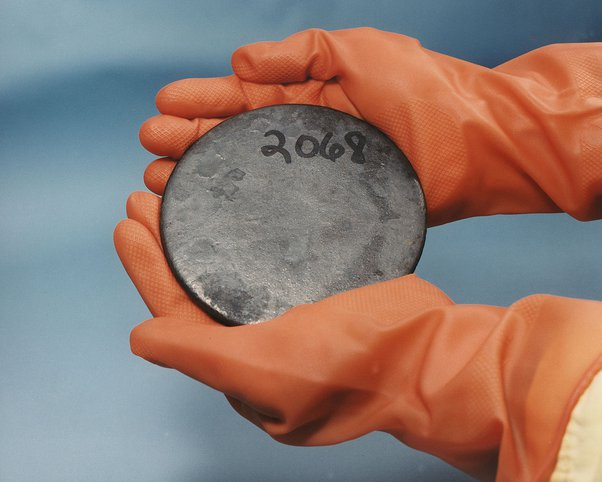

*Réponse publiée [sur Quora](https://fr.quora.com/Si-je-me-trouve-dans-une-mine-d-uranium-et-que-je-tiens-un-morceau-de-minerai-dans-ma-main-est-ce-dangereux/answer/Dr-Goulu)*

Demandez à [La cohorte française des mineurs d’uranium](https://www.irsn.fr/FR/Larecherche/Organisation/equipes/radioprotection-homme/Lepid/Pages/Lepid-cohorte-mineurs-uranium.aspx#.X2LvzUX7R5E) qui a travaillé dans les mines sa vie entière :

> Les analyses conduites sur la cohorte française n'ont pas mis en évidence d'augmentation de la mortalité globale chez les mineurs d'uranium par rapport à la population générale. En revanche, un excès de décès par cancer du poumon a été observé. Ce risque de décès est associé à l'exposition cumulée au radon.

L'[Uranium](w:)naturel est très peu radioactif, vous pouvez même le tenir pur dans vos mains :

Le type porte des gants parce que comme tous les métaux lourds, [l'uranium est chimiquement toxique](w:Uranium). D'ailleurs si vous en mangez quelques grammes, vous allez mourir empoisonné, pas d'irradiation.

Comme indiqué plus haut, le risque pour les mineurs d'Uranium est plutôt le [Radon](w:), un gaz beaucoup plus radioactif produit par la désintégration du [Radium](w:), lui même produit par la désintégration de l'Uranium.

Le radon est un gaz très dense, qui reste donc au fond des mines , ou des caves mal ventilées dans les régions à risque (sols granitiques essentiellement)

[La radioactivité naturelle - Pourquoi Comment Combien](https://www.drgoulu.com/2013/11/03/la-radioactivite-naturelle/)
