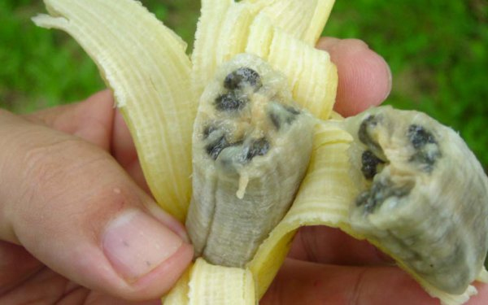

*Réponse publiée [sur Quora](https://fr.quora.com/Comment-les-bananiers-ont-ils-%C3%A9t%C3%A9-cr%C3%A9%C3%A9s-puisquils-ne-peuvent-pas-sauto-ensemencer/answer/Dr-Goulu)*

Jusqu'à preuve du contraire, rien n'a été créé.

Les bananiers sont tout à fait capables de s'ensemencer, vous n'avez qu'à attendre que les bananes mûrissent sur la plante, elles vont tomber en purée contenant chacune des centaines de graines qui vont pousser au pied de leur parent ou être mangées par des animaux et transportées plus loin.

Le problème, c'est que ces graines sont un peu désagréables quand on mange des bananes, alors les humains ont sélectionné l'espèce [Cavendish](w:Cavendish_(bananier))qui dont les graines ne sont pas fécondées ([Parthénocarpie](w:)), ce qui fait qu'on ne voit plus que de petites taches sombres dans la chair de la banane.

La reproduction des plants de Cavendish se fait par [Multiplication végétative](w:) uniquement : 95% de tous les bananiers cultivés dans le monde sont des clones…

[Les origines préhistoriques du bananier - Extra ordinaire Banane](http://extraordinairebanane.fr/2018/10/17/prehistoire-du-bananier)
