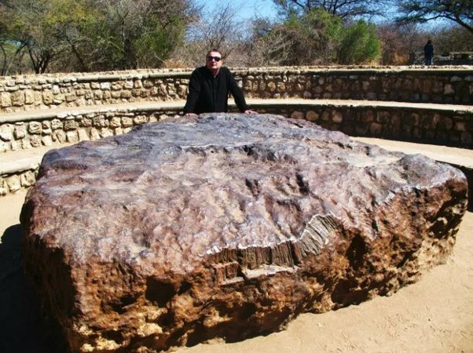

*Réponse publiée [sur Quora](https://fr.quora.com/Pourquoi-lorsqu-une-m%C3%A9t%C3%A9orite-particuli%C3%A8rement-volumineuse-vient-sur-Terre-s-%C3%A9crase-t-elle-toujours-dans-un-crat%C3%A8re/answer/Dr-Goulu)*

Ce n'est pas le cas. Il y en a qui planent et se posent en douceur à la surface.

La [Météorite d'Hoba](w:), la plus grosse connue, 60 tonnes de fer compact, délicatement posée à côté de votre serviteur.

Elle était juste enfouie sous des sédiments, elle a été decouverte par la charrue du paysan qui labourait son champ. Pas d'autre cratère que celui construit pour y accéder.

[Namibie - Pourquoi Comment Combien](https://www.drgoulu.com/2010/08/27/namibie/)
