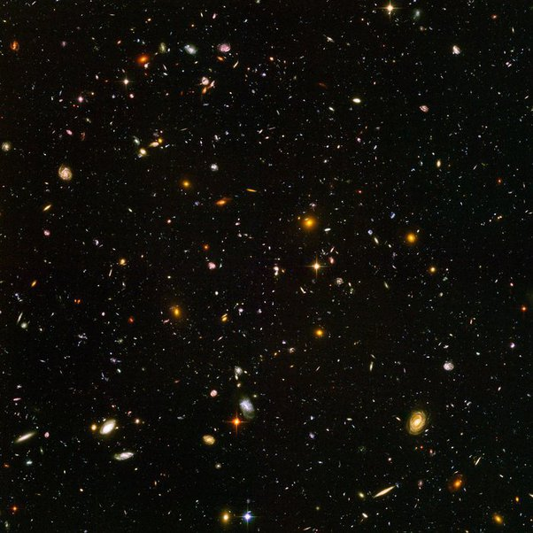

*Réponse publiée [sur Quora](https://fr.quora.com/Avez-vous-des-photos-qui-montrent-%C3%A0-quel-point-l-Univers-est-grand/answer/Dr-Goulu)*

Pas mieux que les [Hubble Ultra Deep Field](https://www.spacetelescope.org/images/heic0611b/) images.

Cette image totalise 11.3 jours d'exposition dans un tout petit coin de ciel tout noir. On n'y distique que 5 étoiles (de notre Galaxie), très peu lumineuses. Ce sont les 5 points qui ont des ["aigrettes" dues à la diffraction dans le télescope.](https://www.drgoulu.com/2009/01/17/inventaire-des-croix-du-ciel/)

Toutes les autres taches sont des galaxies. Il y en a environ 10'000 sur la photo d'origine en 6200x6200. Les rouges à la limite du visible sont à environ 13 milliards d'années-lumière. On les voit donc telles qu'elles étaient il y a 13 milliards d'années, 800 millions d'années après le BB:

On estime que chaque galaxie contient en moyenne 100 milliards d'étoiles, et les mesures actuelles d'exoplanètes laissent supposer environ 1.6 planètes par étoile en moyenne.

Sur cette photo, vous avez donc un million de milliard d'étoiles et encore plus de planètes, et un nombre indéterminé, mais selon toute probabilité très grand, d'êtres intelligents regardant une image analogue en se disant "wow, c'est vraiment très grand … "
