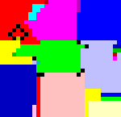
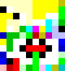

*Réponse publiée [sur Quora](https://fr.quora.com/Existe-t-il-des-langages-de-programmation-utilisant-un-autre-alphabet-que-le-latin/answer/Dr-Goulu)*

Oh oui !

Dans les [Langage de programmation exotique](w:)on trouve notamment:

- [PIET](https://www.dangermouse.net/esoteric/piet.html), qui s'exprime par des couleurs sur une matrice, ce qui fait que les programmes ressemblent à des tableaux de Mondrian:





- [Whitespace](w:en:Whitespace_(programming_language)), qui s'écrit uniquement avec des espaces, des tabs et des retours de ligne. Voici "Hello World" avec des S, T et L juste pour la lisibilité …

```
S S S T	S S T	S S S L
T	L
S S S S S T	T	S S T	S T	L
T	L
S S S S S T	T	S T	T	S S L
T	L
S S S S S T	T	S T	T	S S L
T	L
S S S S S T	T	S T	T	T	T	L
T	L
S S S S S T	S T	T	S S L
T	L
S S S S S T	S S S S S L
T	L
S S S S S T	T	T	S T	T	T	L
T	L
S S S S S T	T	S T	T	T	T	L
T	L
S S S S S T	T	T	S S T	S L
T	L
S S S S S T	T	S T	T	S S L
T	L
S S S S S T	T	S S T	S S L
T	L
S S S S S T	S S S S T	L
T	L
S S L
L
L

```

La video à voir absolument si vous aimez ce genre de trucs :

[https://www.youtube.com/watch?v=...](https://www.youtube.com/watch?v=6avJHaC3C2U)
