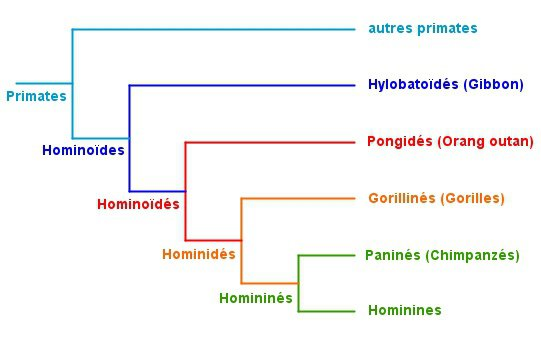

*Réponse publiée [sur Quora](https://fr.quora.com/Est-il-vrai-que-le-singe-est-lancêtre-de-lhomme-ou-est-ce-un-abus-de-langage-si-tel-est-le-cas-ou-trouve-t-il-son-origine/answer/Dr-Goulu)*

voilà :

Attention à la distinction tout en bas entre

- Hominines (sans accent) qui est la dénomination en français de la sous-tribu [Hominina](w:)qui contient toutes les espèces du genre [Homo](w:)dont Sapiens est le seul représentant actuel
- Homininés (avec accent) qui est la dénomination en français de la la tribu des [Hominini](w:) qui regroupe les précédents et leurs plus proches cousins, les Chimpanzés et Bonobos

Parfois le latin est plus clair …
