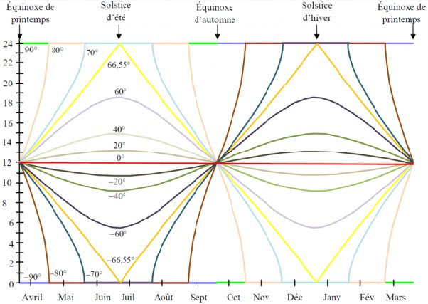

*Réponse publiée [sur Quora](https://fr.quora.com/Quel-est-le-pays-o%C3%B9-les-journ%C3%A9es-sont-les-plus-longues-en-moyenne-sur-lann%C3%A9e/answer/Dr-Goulu)*

La [Durée du jour](w:)varie en fonction de la latitude comme ceci :

On voit que toutes les courbes sont des [fonctions impaires](w:Parité_d'une_fonction) autour des points (équinoxe, 12h) : la surface entre la courbe et l'horizontale 12h pendant l'été est exactement la même (au signe près) que la surface entre la courbe et l'horizontale 12h pendant l'hiver.

La moyenne annuelle de la durée du jour où que ce soit sur Terre est rigoureusement égale à 12h.

Bon, quand je dis "rigoureusement" on pourrait chipoter sur les montagnes ou les effets dus à l'atmosphère, mais à quelques secondes près, c'est 12h partout.

(voir [Combien dure un jour - Pourquoi Comment Combien](/2013/08/11/combien-dure-un-jour/) )
