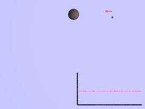

*Réponse publiée [sur Quora](https://fr.quora.com/Si-un-objet-dur-ou-un-vaisseau-spatial-glisse-avec-la-vitesse-de-la-lumi%C3%A8re-pr%C3%A8s-de-l-horizon-des-%C3%A9v%C3%A9nements-d-un-trou-noir-mais-ne-va-pas-au-del%C3%A0-est-il-possible-qu-il-acqui%C3%A8re-l-acc/answer/Dr-Goulu)*

Un "objet dur ou un vaisseau spatial" ne peut pas se déplacer à la vitesse de la lumière. Même pas une particule ayant une masse.

Mais il peut, disons, aller à 99% de c.

Et là je vais vous décevoir, mais l'[Assistance gravitationnelle](w:) d'un objet isolé ne permet pas d'accélérer. Cette technique permet de prendre de l'énergie cinétique à un objet comme Jupiter ou Saturne qui est lui-même en mouvement par rapport à un autre, le Soleil en l'occurrence. L'assistance gravitationnelle permet d'accélérer par rapport au Soleil, pas par rapport à Jupiter ou Saturne :

Donc il faudrait que le trou noir soit lui-même en orbite autour d'un (gros) trou noir pour accélérer avec cette technique

Mais il existe une autre technique permettant d'accélérer à proximité d'un trou noir isolé, pourvu qu'il tourne (ce qui est le cas de tous les vrais trous noirs[[1]](#dURZH) ) : le [Processus de Penrose](w:). C'est un effet relativiste plus compliqué, mais ça accélère.

Donc votre vaisseau va passer de 99% à peut être 99.9% de c. Et si vous refaites des passages, à 99.99% puis 99.999% de c, et ainsi de suite.

Parce que la vitesse de la vitesse de la lumière est infinie pour le passager.

Notes de bas de page

[[1]](#cite-dURZH)[A combien tourne un trou noir ? - Pourquoi Comment Combien](https://www.drgoulu.com/2016/07/10/combien-tourne-un-trou-noir/)
