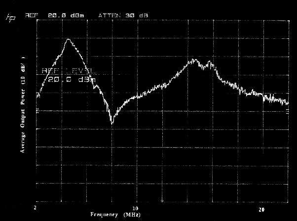

*Réponse publiée [sur Quora](https://fr.quora.com/Oscillateur-a-multiples-ondes-de-Lakhovsky-Comment-mesurer-les-frequences-a-faible-puissance-pour-voir-si-ca-cree-quelque-chose-ou-pas/answer/Dr-Goulu)*

j'ai l'impression que tout ce bidule est très sensible aux tolérances. Petites différences de dimensions, d'impédance, dilatation thermiques, tout ça doit faire varier les harmoniques dans tous les sens …

les [Émetteur à étincelles](w:)avaient un spectre "continu" très large, de plusieurs Mhz

source : [Spark Transmitter](http://www.hammondmuseumofradio.org/spark.html)

je pense que la grosse variation est due à l'antenne, parce que dans mon souvenir des machines à électroérosion, c'était beaucoup plus plat que ça …
