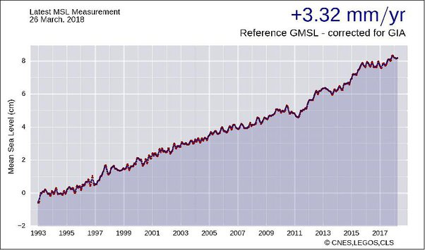

*Réponse publiée [sur Quora](https://fr.quora.com/Comment-sy-retrouvé-avec-la-montée-des-eaux-Certaines-parlent-de-60cm-dici-2100-et-dautres-de-25m-dici-2030-Comment-ses-valeurs-peuvent-elles-être-aussi-différentes/answer/Dr-Goulu)*

ok, -3 cm pour 1990–2000 … mais alors pourquoi se limiter à un siècle ? quand on voit la gueule des prévisions, ça ne sera pas fini en 2100 …

1990 a été choisi parce que [TOPEX/Poseidon](w:) permet une mesure global précise depuis 1992 (courbe rouge) puis les [Jason](w:Jason_(satellite)) 1,2,3, et les [Sentinel-6](w:)à partir de cette année.

D'après les mesures de [Satellite Missions : Jason 3](https://directory.eoportal.org/web/eoportal/satellite-missions/j/jason-3) on avait +8 cm entre 1997 et 2018

donc on est plutôt sur le haut de la surface orange , ou même sur la courbe grise au dessus (qui correspond si j'ai bien compris à une décharge massive des glaciers du Groenland et de l'Antarctique dans la mer.

Dans les deux cas, le problème concernera plutôt le 22 ème siècle et les suivants, avec un hausse de plus d'1m par siècle, parce que c'est pas le genre de phénomène à s'arrêter en 10 ans …
