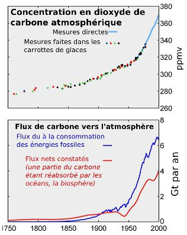

*Réponse publiée [sur Quora](https://fr.quora.com/Les-fuites-massives-de-méthane-séchappant-des-zones-de-productions-de-gaz-et-de-pétrole-observées-par-satellite-ne-constituent-elles-pas-une-preuve-irréfutable-que-le-réchauffement/answer/Paul-Henri-Doumenc)*

Climatologue c'est un métier. Les gens qui font ça le font aussi sérieusement que vous faites votre boulot, et ils ne viennent pas vous expliquer quels paramètres utiliser. Si vous voulez savoir comment ils font, lisez les publications.

Le problème est que les 3% d'émissions humaines ne sont absorbées qu'en partie et s'accumulent dans l'atmosphère. Le fait est que la concentration de CO2 dans l'atmosphère est passé de 280ppm au 18ème siècle à plus de 400ppm, ce qui correspond exactement aux émissions humaines, moins ce qui a commencé à sérieusement acidifier les océans.

