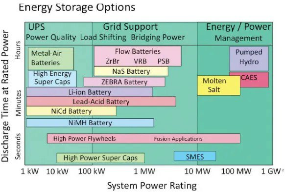

*Réponse publiée [sur Quora](https://fr.quora.com/Quel-est-le-moyen-le-moins-co%C3%BBteux-de-stocker-l%C3%A9lectricit%C3%A9-de-mani%C3%A8re-fiable/answer/Dr-Goulu)*

Ça dépend Combien d'électricité, pendant combien de temps, de la vitesse et du nombre de cycles de charge/décharge.

En fait on ne stocke de l'électricité que dans les condensateurs, et éventuellement dans des bobines, mais ça ne dure pas plus de quelques secondes.

En pratique on convertit l'électricité en énergie chimique ou mécanique, on la stocke sous cette forme et on la reconvertit en électricité au besoin.

En faisant l'inventaire des méthodes dans

[Comment stocker l'énergie - Pourquoi Comment Combien](/2012/10/07/comment-stocker-lenergie/)

j'étais tombé sur ce graphique très intéressant :

Il montre les différentes technologies existantes en terme de puissance et de temps pendant lequel cette puissance est disponible en décharge. Le produit des deux axes donne donc l'énergie accumulable en Wh.
