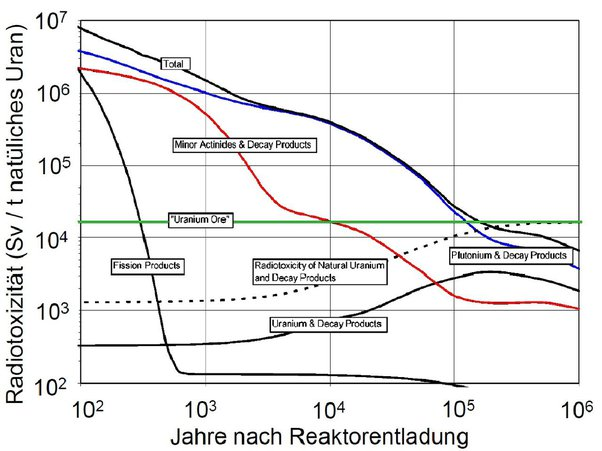

*Réponse publiée [sur Quora](https://fr.quora.com/Quel-est-le-d%C3%A9bit-de-dose-au-contact-d-un-colis-de-d%C3%A9chets-radioactifs-de-haute-activit%C3%A9-au-bout-d-une-centaine-d-ann%C3%A9es/answer/Dr-Goulu)*

D'après la figure ci-dessous tirée de [http://iktp.tu-dresden.de/IKTP/S...](http://iktp.tu-dresden.de/IKTP/Seminare/IS2009/Kolloq-TUD-Arnd_Junghans.pdf)

elle est environ 400 fois supérieure à celle du minerai d'Uranium (ligne verte correspondant aux conditions dans une mine d'Uranium)

Un "colis" contient 50 kg de déchets HALV, et d'après [Uranium Radiation Individual Dose Calculator](https://www.wise-uranium.org/rdcu.html), 50 kg de minerai à 2% d'Uranium à 1m de distance donnent un débit de dose de 2,026 µSv/h (17,76 mSv/année)

400 fois plus que ça, c'est 800 µSv/h, donc 7 Sv/année.

[Bure, plongée dans l'éternité - Pourquoi Comment Combien](/2014/05/24/bure-pour-leternite/#.X5V0nNAVOCo)
