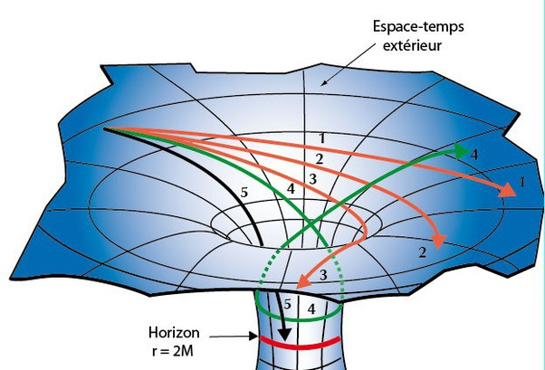

*Réponse publiée [sur Quora](https://fr.quora.com/Est-il-possible-quune-particule-soit-accélérée-au-point-de-devenir-un-trou-noir-Si-tel-est-le-cas-quelle-sera-sa-vitesse-relative-à-la-lumière/answer/Jean-Bossaert)*

une géodésique est une droite dans un espace courbe. exemples autour d'un trou noir :

un objet non accéléré va tout droit, donc sur une géodésique. S'il est accéléré, il passe d'une géodésique à une autre de façon continue.
