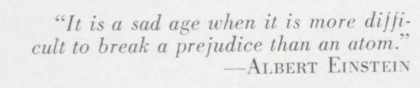

*Réponse publiée [sur Quora](https://fr.quora.com/Einstein-a-d%C3%A9clar%C3%A9-Il-est-plus-facile-de-briser-l-atome-que-de-briser-les-pr%C3%A9jug%C3%A9s-La-science-a-r%C3%A9ussi-%C3%A0-briser-l-atome-Pourquoi-l-%C3%A9ducation-ne-peut-elle-pas-briser-les-pr%C3%A9jug%C3%A9s/answer/Dr-Goulu)*

Une fois de plus ( [Ce qu'Einstein n'a jamais dit - Pourquoi Comment Combien](https://www.drgoulu.com/2008/11/26/ce-queinstein-na-jamais-dit/#.X5upi4gVOCo) …) cette citation n'est probablement pas d'Einstein. D'abord en anglais on la trouve plutôt sous la forme

> What a sad era when it is easier to smash an atom than a prejudice.

et la plus ancienne semble être

> It is a sad age when it is more difficult to break a prejudice than an atom.

qu'on devrait plutôt traduire par

> Triste époque où il est plus difficile de briser un préjugé qu'un atome

qu'on trouve selon[[1]](#MLstL) dans le journal [Facts Forum News, Vol. 4, No. 7, August 1955](https://digital.lib.uh.edu/collection/1352973/item/1399/show/1331), mais sans source :

Sans source, ça veut dire que ce journal a publié cette phrase en l'attribuant à Einstein quelques mois après sa mort sans indiquer où ni quand il aurait dit ou écrit ça.

Bref ça vaut moins qu'un retweet .

Le principe de base, c'est qu'un type intelligent comme Einstein ne sort pas des sentences à deux balles sur des sujets qu'il ne connaît pas. Einstein était un manche en éducation, mais qu'il aurait tout a fait été conscient de l'auto-référence possible de cette phrase, aussi descriptible par l'expression "c'est celui qui dit qui est".

Sans contexte ni référence, cette phrase n'est-elle pas elle même un préjugé ?

Et qu'est-ce qui vous permet de dire que l'éducation ne brise pas les préjugés ? Elle a brisé pratiquement tous les miens. En les remplaçant par d'autres diront certains.

Notes de bas de page

[[1]](#cite-MLstL)[Talk:Albert Einstein](https://en.wikiquote.org/wiki/Talk:Albert_Einstein#Unsourced_and_dubious.2Foverly_modern_sources)
