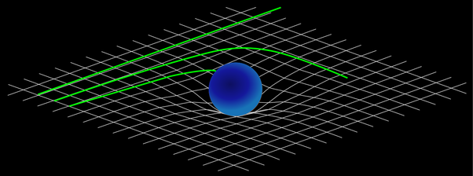
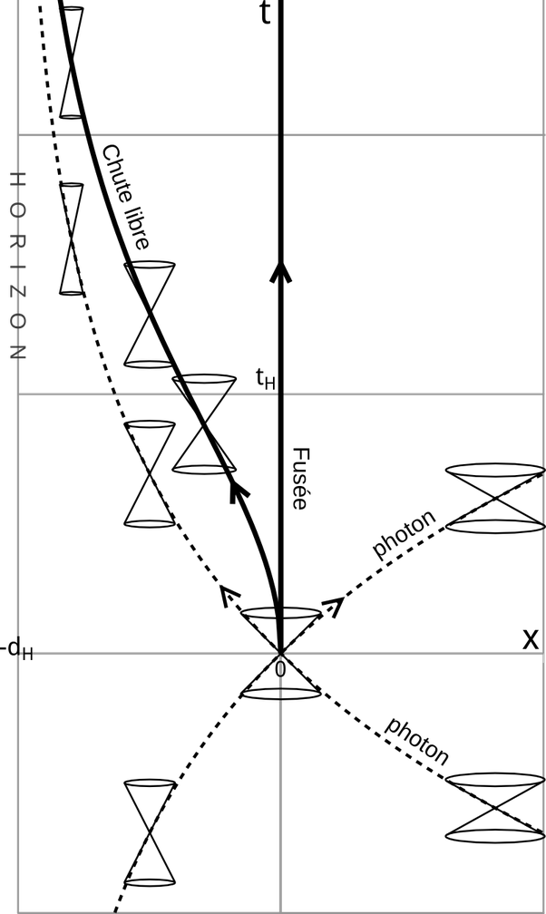

*Réponse publiée [sur Quora](https://fr.quora.com/Quest-ce-que-lespace-temps-Que-voulait-dire-Einstein-quand-il-a-dit-quil-%C3%A9tait-courb%C3%A9/answer/Dr-Goulu)*

il voulait dire

$$R_{\mu \nu} \ - \ \frac{1}{2} \, g_{\mu \nu} \, R  \ + \ \Lambda \ g_{\mu \nu} \ =  \kappa T_{\mu \nu}$$

(voir [Équation d'Einstein — Wikipédia](w:Équation_d'Einstein) pour les détails)

Je suis désolé, mais on n'arrive pas à décrire ça correctement autrement qu'en maths parce que nous ne pouvons pas "sortir" de notre univers 3D + 1 temps pour le voir comme un objet mou qu'on peut écraser, dilater, tordre etc.

Il n'y a que les maths qui permettent de décrire ça correctement (= conformément à nos expériences)

On voit parfois des images "2D 1/2" comme celle-ci :

mais elles sont extrêmement réductrices. C'est d'ailleurs probablement pour ça qu'on parle de "**courbure**" de l'espace-temps (je ne crois pas que le mot soit d'Einstein) Il vaudrait mieux dire que les trois lignes vertes ci-dessus sont des [Géodésiques](w:Géodésique) dans un espace-temps **déformé**par les masses.

Et pour la dimension temporelle, c'est encore plus compliqué à visualiser parce que selon la géométrie décrite par le [tenseur métrique](w:) de [signature](w:Signature_(logique)) (+,-,-,-) ( $g_{\mu \nu}$ dans l'équation d'Einstein), le temps est une dimension "imaginaire" au sens des nombres complexes.[[1]](#JPMRK) On voit assez couramment des [Diagramme de Minkowski](w:)dans lequel on représente une seule dimension d'espace (horizontal) et le temps (vertical)comme celui-ci par exemple :

Les petits cônes représentent les [Cône de lumière](w:) en chaque point de cet espace , que l'on peut se représenter comme la portion d'espace-temps "causalement liée" au point dans ce référentiel. Disons pour fixer les idées que chaque cône représente 1 seconde (verticalement) et une seconde-lumière (horizontalement) dans le référentiel local, ce qui permet de visualiser les contractions/dilatations de l'espace et du temps relatives

Notes de bas de page

[[1]](#cite-JPMRK)[Le temps, une 4ème dimension imaginaire - Pourquoi Comment Combien](/2007/02/07/le-temps-une-4eme-dimension-imaginaire/)
