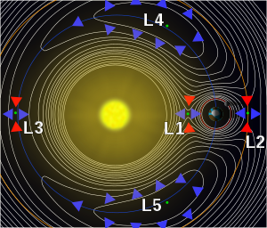

*Réponse publiée [sur Quora](https://fr.quora.com/À-quelle-distance-faudrait-il-placer-un-corps-entre-la-Terre-et-la-Lune-pour-que-la-force-d-interaction-gravitationnelle-de-la-Lune-compense-exactement-celle-de-la-Terre/answer/Dr-Goulu)*

L1 est instable : il faut utiliser un peu de carburant de temps en temps pour maintenir un objet à ce point sinon la moindre pichenette le fera basculer d'un côté ou de l'autre du "col gravitationnel"

