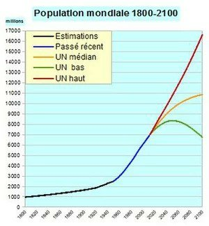

*Réponse publiée [sur Quora](https://fr.quora.com/J-ai-l-impression-que-le-savoir-qu-on-accumule-au-fils-des-si%C3%A8cles-nous-d%C3%A9truit-ainsi-que-notre-%C3%A9cosyst%C3%A8me-Donc-l-intelligence-savoir-nous-rend-t-il-vraiment-heureux/answer/Dr-Goulu)*

Le savoir ne rend peut être pas heureux, mais plus nombreux, en bonne santé et (relativement) riche.

On ne meurt presque plus de faim, de maladie infectieuse ou lors de l'accouchement. L'espérance de vie n'a jamais été aussi élevée, et nous sommes bientôt 8 milliards alors que nous étions 1 milliard en 1800. Nous sommes loin d'être "détruits", nous sommes en plein boom !

Regardez autour de vous : en 1800, 7 personnes sur 8 n'auraient pas été là. Votre mère aurait eu 4 enfants de plus morts en bas âge. Vos grands parents auraient eu de la chance de vivre à 60 ans.

Et côté pollution, le smog du au charbon était bien pire que les pollutions actuelles. N'oubliez pas le [Grand smog de Londres](w:)qui fit 10'000 morts en 1952 dans une des villes les plus prospères du monde.

Aujourd'hui nous ne brûlons plus nos ordures en plein air, les usines filtrent leurs rejets beaucoup plus que par le passé, on recycle de plus en plus, les énergies renouvelables progressent très vite etc.

Bien sur qu'il y a encore (et toujours) des problèmes énormes à résoudre. Mais je préférerais qu'on les résolve grâce au savoir plutôt qu'une guerre nous ramène en 1800, ou avant.
